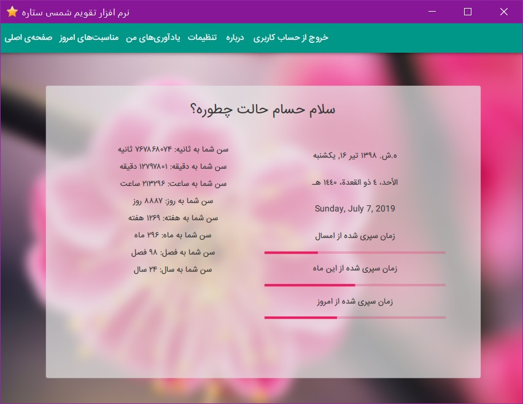
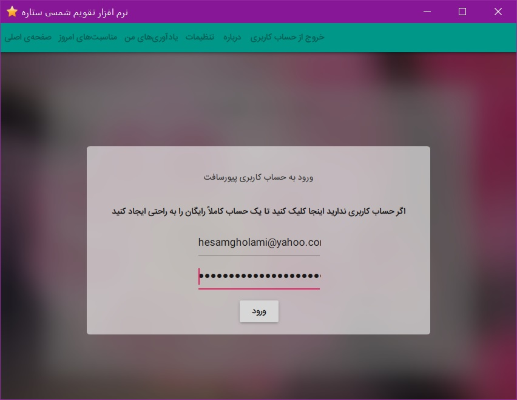
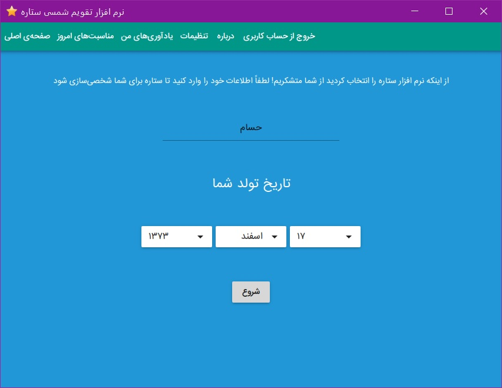
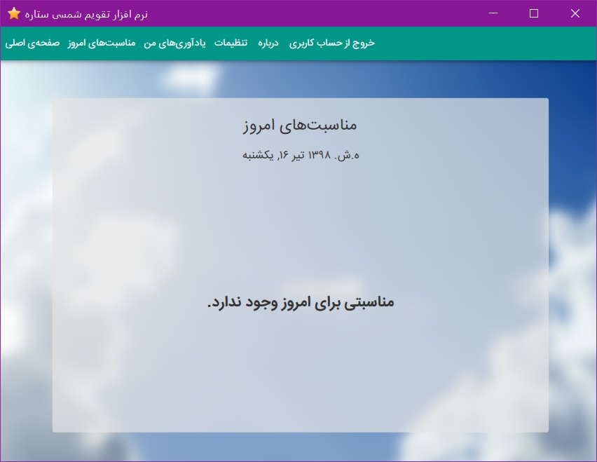
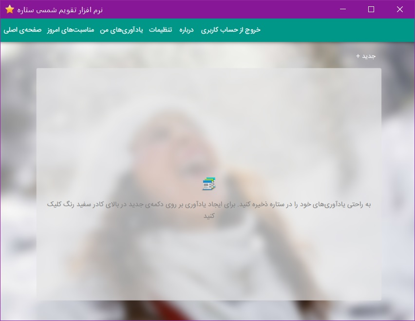
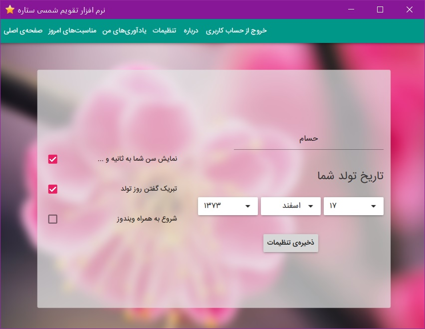
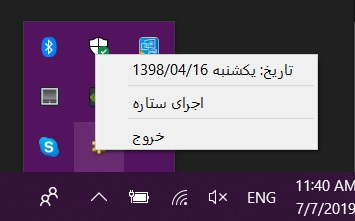

= The Star Persian Calendar
Hesam Gholami <hesamgholami@yahoo.com>
v1.0, 2019-05-16

++++
<link rel="stylesheet"  href="http://cdnjs.cloudflare.com/ajax/libs/font-awesome/3.1.0/css/font-awesome.min.css">
++++
:icons: font
:experimental: true

This project is a Persian Jalali calendar app along with a reminder managemant section to help user organize their tasks.

== Quick Start

To use this project all we need is installing Qt from:

https://qt.io

Now we are good to go and clone the repository!

== Project Structure

Star is written using Qt and Qt Quick framework. So we have a C++ backend with a QML based user interface.

Also we use *Facade* pattern in C++ section to manage the structure of application. This will get us a general purpose object named `s` which we can use in our C++ backend and access all of Star objects.

== Application Features

Star has multiple features which all of them are online and depend on Pure Soft online Star API v4. We will cover all features in this readme.

=== Login Form

First thing that we will face is the login form. This form will get user account information in Pure Soft and then generate a token and save it to be used later instead of password.

For creating a Pure account please visit: https://puresoftware.org/go/register

Also for getting familiar with the mechanism of access token generation you can see related RFC at https://tools.ietf.org/html/rfc6749 .

=== Account Setup

When a user registers in Pure Soft and then installs Star, it has not any star settings yet, so the Pure Star API will return a `404` response when we try to fetch their settings, this code can be used to show the user the Star account setup wizard. When user completes the wiard, we will send the configuration to Pure Star API to create a Star account for them. After that when we try to fecth user settings, we will get that configuration instead of `404` result.
Using this mechanism we can keep user settings online in all of their devices.

=== Home Page

In Star home page, we will show a brief of today date alog with user birthday converted in seconds, minutes, etc.
At the bottom we will show the past amount of today time, this month days and this year days as progress bars.

Note that user can desiable showing birthday in various formats in settings. We will cover it in settings features later in this readme.

=== Today Events

Star has a page to show today events, in jalaly calendar. This feature uses the Pure Star API v4 to provide the calendar informations online. Our app will send the Jalali date to the API and then will get back with events.
Also the API will tell us if today is holiday or not and we will show that to our users.

=== Reminders

One of the nice features of Star is its online reminders.

Users can create multiple reminders for various works and Star will save then in cloud to be shown to them in all of their devices and also in Pure account.

This section is obviously using the Pure Star v4 API to manipulate reminders.

Users can created, edit and delete cards with title, descrption, date and time which only *title* field is mandatory and rest of them are optional.

If a reminder has date or time, we can remind user in specified time using our *systray* app which we will cover in a second.

=== Star Settings

The Pure Star API v4 has a section for storing user configurations in Star. So we can use it to store various user settings. These settings are placed in a tab with the same name in Star app and any chnages that user will made to this section will be saved online and synced with other devices of the same user.

In this section user can select the visibility of showing birthday in various formats, celebrating birthday, starting app with windows and other user details.

== The Star Systray App

There is another app in `star-systray` folder which will be used to run in background and show reminders due time to user.

So if user want to see the reminders, they should keep this running in the background.

Note that this app is separated from main Star app and can only show system notifications and has no user interface.

== Contributing

If you enjoyed this project, please consider contributing to it and make it better. And don't forget to follow us in social media.

And please don't forget to give a star to this project.

Thank you and happy coding!
